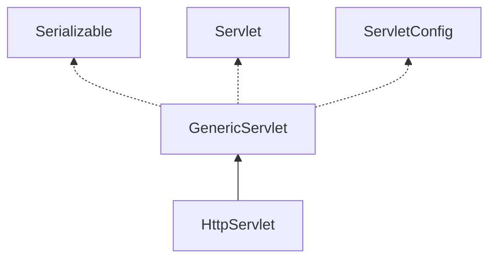
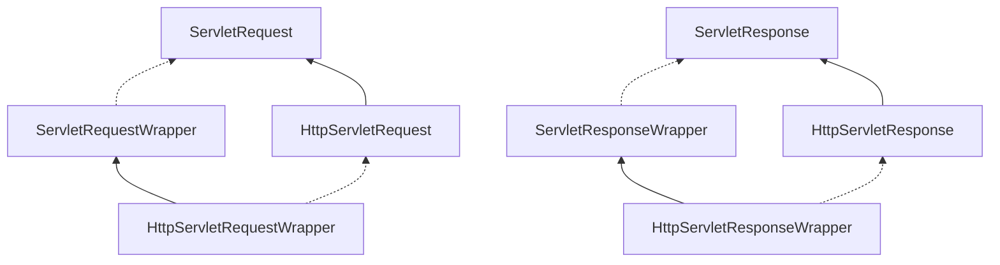

浅析在java web开发中使用的servlet。
<!-- more -->
## 1. main


servlet实例化,服务。
1. `Servlet`: init,service,destroy
2. `GenericServlet`
3. `HttpServlet`: doGet,doPost...
4. `ServletConfig`: Config
5. `ServletContext`: Context
6. `Request`: 请求
7. `Response`: 响应

## 2. Wrapper

`ServletRequestWrapper`,`ServletResponseWrapper`,`HttpServletRequestWrapper`,`HttpServletResponseWrapper`

对于`ServletRequest`,`ServletResponse`,`HttpServletRequest`,`HttpServletResponse`，servlet提供给开发者wrapper装饰类。开发者可以使用改变属性，扩展功能等,例如验证参数，过滤数据，自定义功能等。

## 3. ServletContainerInitializer

servlet 3.0提供开发者`ServletContainerInitializer`，可以通过实现`ServletContainerInitializer`接口来注册初始化应用，从而取代`web.xml`。

1. 使用`web.xml`时，web容器会寻找`web.xml`进行初始化应用。
2. 使用实现`ServletContainerInitializer`时，web容器会寻找`ServletContainerInitializer`的实现类，并调用`onStartup`进行初始化应用。

可参考`SpringServletContainerInitializer`,`TomcatStarter`

## 4. Listener

servlet有如下Listener：
1. `ServletContextListener`，`ServletContextAttributeListener`：

    监听`ServletContext`，例如Spring中`ContextLoaderListener`创建`WebApplicationContext`。

2. `ServletRequestListener`，`ServletRequestAttributeListener`：

    监听`ServletRequest`，例如Spring中`RequestContextListener`，进行`setLocale`等。
3. `AsyncListener`

    异步监听

4. `HttpSessionListener`，`HttpSessionIdListener`，`HttpSessionAttributeListener` 

   session的监听，创建，销毁，属性值变化，sessionIdChanged

5. `HttpSessionActivationListener`

   session序列化监听

6. `HttpSessionBindingListener`

   `valueBound()`: 数据对象绑定到session监听

   `valueUnbound`: 解绑监听
    
7. `WriteListener`,`ReadListener`

名称以Listener结尾的一般为创建销毁监听，AttributeListener为属性变化监听。


## 5. Filter

`Filter`,`FilterChain`,`FilterConfig`

## 6. Asyn

servlet3.0支持异步。

```java
void start(Runnable run);
```
