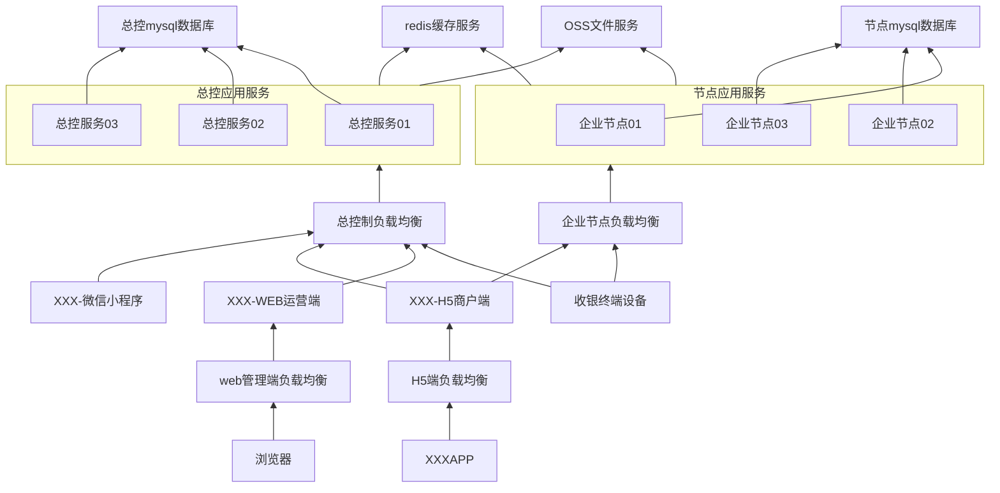
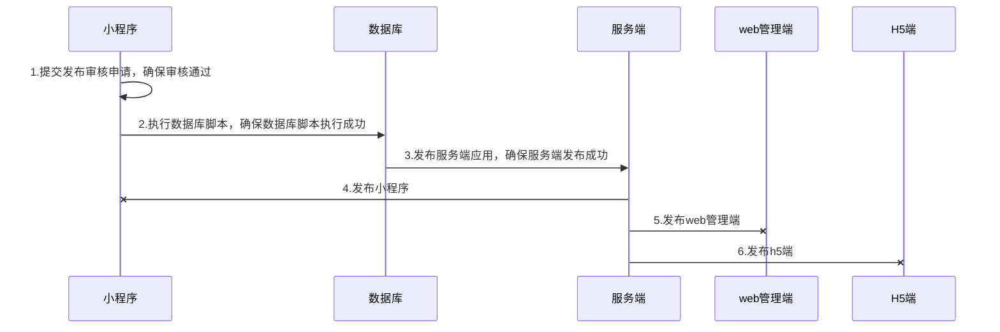
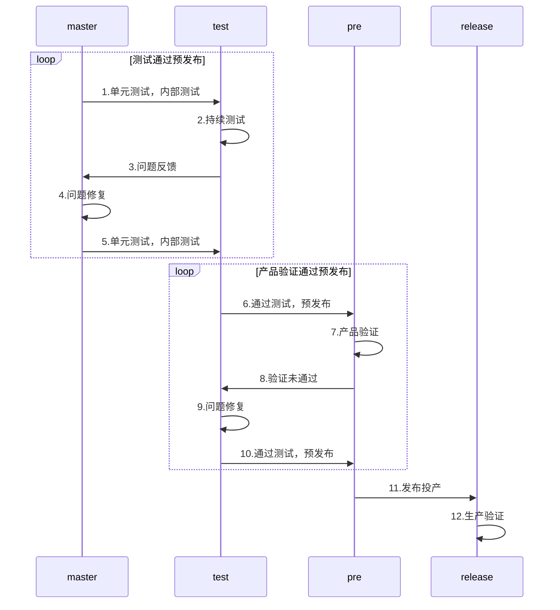
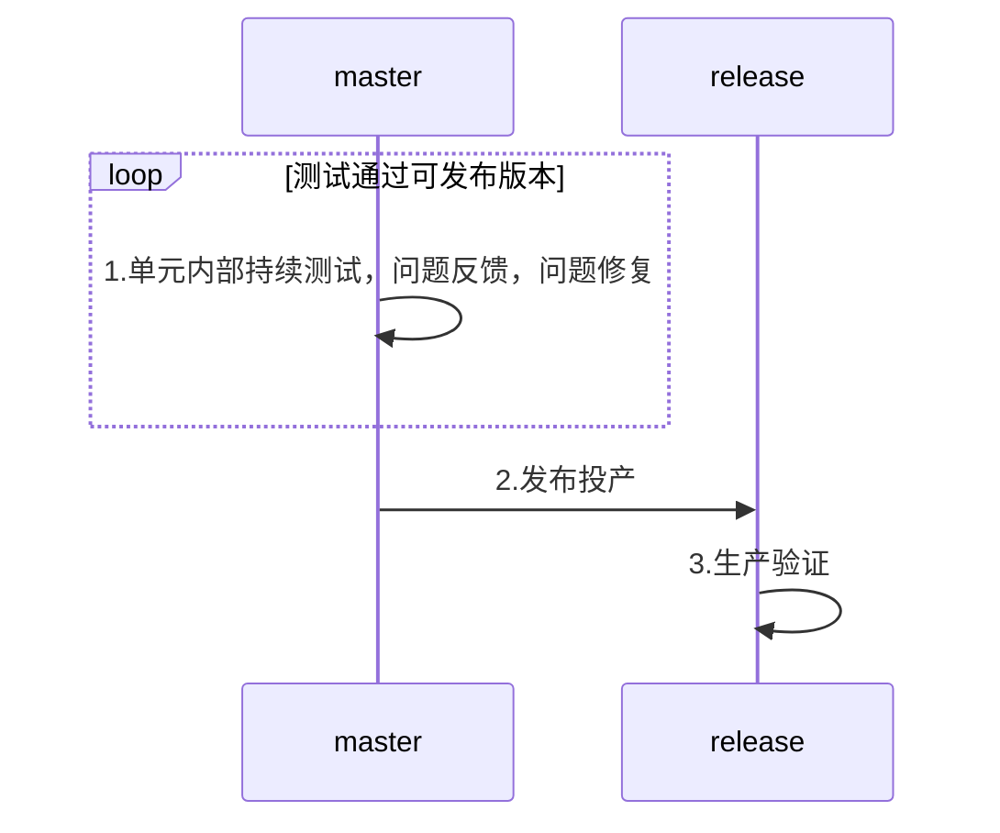
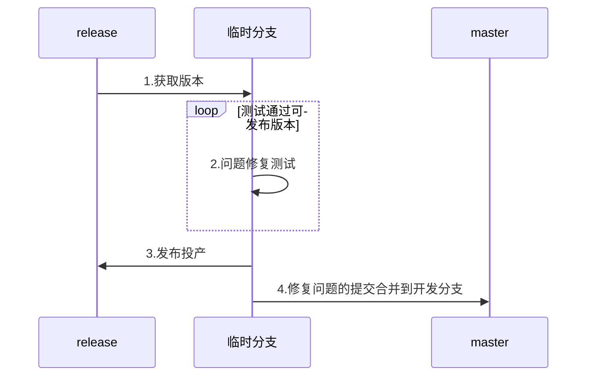

最近进行项目的交接与培训，分享一个使用的系统架构部署及运维手册。
<!-- more -->

## XXX系统部署运维手册

### 1 文档简介

本文详细介绍了XXX系统架构及部署运维，是XXX系统的部署运维手册。

主要内容为：XXX系统的架构部署，迭代更新方法，全新部署方法，系统日常运维，运维过程中常见问题。

### 2 修订版本

| 版本 | 修订人 | 修订日期 | 说明 |
| -------- | :-----: |:-----: |:-----: |
| V1.0.0 | yzq | 2020-08-26 | init |

### 3 系统概述

#### 3.1 部署图



#### 3.2 服务器详解

目前XXX系统一共使用16台服务器。分别为：
1. 数据存储(阿里云RDS，阿里云redis，阿里云OSS)：总控mysql数据库，节点mysql数据库，redis缓存服务，OSS文件服务。
2. 应用服务器(阿里云ECS)：服务端6台（总控服务端3台，节点服务端3台），web管理端服务器，H5服务器。
3. 负载均衡(阿里云负载均衡)：总控负载均衡，企业节点负载均衡，web管理端负载均衡，H5端负载均衡。

#### 3.3 服务器配置

##### 3.3.1 数据存储服务器

| 名称 | 应用版本 | 型号 | 规格 | 配置 | 存储 |
| -------- | :-----: |:-----: |:-----: |:-----: |:-----: |
| 总控mysql数据库 | mysql5.7 | 独享套餐 | mysql.x4.large.2 |4核16GB内存（独享型）2500最大连接数4500IOPS|本地SSD硬盘 1T|
| 节点mysql数据库 | mysql5.7 | 独享套餐 | mysql.x4.large.2 |4核16GB内存（独享型）2500最大连接数4500IOPS|本地SSD硬盘 500G|
| redis缓存服务 | redis5.0 | 企业版 | 性能增强型 |标准版4G主从版性能增强||


| 名称 | bucket |
| -------- | :-----: |
| OSS文件服务 |tq-hsh |

##### 3.3.2 server应用服务器

| 名称 | 应用版本 | 型号 | 规格 | 配置 | 存储 |
| -------- | :-----: |:-----: |:-----: |:-----: |:-----: |
| 总控应用服务 | CentOS 7.3 64位 | 通用型g6 | ecs.g6.xlarge |4 vCPU 16 GiB	|SSD云盘 40G|
| 节点应用服务 | CentOS 7.3 64位 | 通用型g6 | ecs.g6.xlarge |4 vCPU 16 GiB	|SSD云盘 40G|

##### 3.3.3 web应用服务器

| 名称 | 应用版本 | 型号 | 规格 | 配置 | 存储 |
| -------- | :-----: |:-----: |:-----: |:-----: |:-----: |
| WEB运营端 | CentOS 7.3 64位 | 通用型g6 | ecs.g6.xlarge |4 vCPU 16 GiB	|SSD云盘 40G|
| H5商户端 | CentOS 7.3 64位 | 通用型g6 | ecs.g6.xlarge |4 vCPU 16 GiB	|SSD云盘 40G|

##### 3.3.4 负载均衡服务器

| 名称 | 型号 |
| -------- | :-----: |
| 负载均衡服务器 | 标准型I (slb.s2.small) |

### 4 更新投产

在进行正常迭代更新投产时，使用以下方法进行更新投产。

#### 4.1 投产时序图



通过以上图示进行XXX系统的的迭代更新投产，具体步骤为：
1. 提交小程序的发布审核申请，等待小程序端过审，确保过审后进行下个步骤。
2. 整理本次数据库变动脚本，并在生产数据库执行数据库脚本，确保数据库脚本执行成功。
3. 发布java服务端应用，保证发布成功。
4. 发布小程序，发布web管理端，发布H5端。
5. 生产验证，更新投产成功。

#### 4.2 应用版本管理

##### 4.2.1 配置文件

服务端应用配置三种配置分别为dev，test，release。未有测试组可只使用dev和release配置。
1. dev：开发环境配置
2. test：测试环境配置
3. release：生产环境配置

##### 4.2.2 版本分支

服务端应用使用主要使用四条git分支分别为：master，test，pre，release。未有测试组和预发布可只使用master和release分支。根据实际情况使用临时分支。
1. master：开发分支
2. test：测试分支
3. pre：预发布分支
4. release：生产分支

通过git分支进行版本的管理，使用`merge`进行分支合并，如下图所示：


上图示为正常应用版本发布流程，未有测试组和预发布使用下图示流程：

发生生产环境重大问题紧急修复时，创建临时分支修复发布，并`merge`到开发环境：


##### 4.2.3 系统版本号

每次发布投产必须使用tag标记，tag名称为本次发布的版本号，并把详细内容描述在tag详情中。

版本号示例：`release1.0.5-pro-20200814`

版本号规范：release[主版本号].[次版本号].[修订号]-pro-[发布日期yyyymmdd]

主版本号：不兼容的API修改，提升该版本号。

次版本号：向下兼容的比较大的功能修改，提升该版本号。

修订号：向下兼容的问题修改，提升该版本号。

#### 4.3 生产部署

按照4.1 投产时序图示例进行系统的发布，详细步骤如下描述：

##### 4.3.1 小程序发布

提交小程序的发布审核申请，直到审核通过。

##### 4.3.2 数据库更新

整理本次更新投产的数据库变动内容，登录到阿里云控制台或登录生产局域网跳板机执行本次变动脚本，保证执行成功。

##### 4.3.3 java服务端应用发布

1. tag版本号的确认，并新增tag
2. 在可以发布的本次更新分支上使用本地`mvn`打包或者使用`jenkins`进行打包，得到`control.war`（总控）与`node.war`（节点）应用包，注意使用生产环境配置。

  打包命令
  ```shell
  mvn clean install -P release
  ```
3. 将`control.war`和`node.war`应用包上传到跳板服务器的`root`目录下，执行`copy-war.sh`脚本，会自动发布java应用，并把本次发布应用包以日期命名备份到`/root/backup`目录下。

  执行成功验证各服务应用状态。如果出现发布失败，立即把`/root/backup`下上一次发布的包拷贝重命名到`/root`下并执行`copy-war.sh`脚本恢复服务。

  执行copy-war.sh脚本命令。
    ```shell
    sh copy-war.sh
    ```
  copy-war.sh内容
    ```shell
    cp /root/control.war /root/tomcat/webapps/control.war
    sleep 10
    scp /root/tomcat/webapps/control.war root@192.168.100.131:/root/tomcat/webapps/control.war
    sleep 10
    scp /root/tomcat/webapps/control.war root@192.168.100.134:/root/tomcat/webapps/control.war
    sleep 10
    scp /root/node.war root@192.168.100.130:/root/tomcat/webapps/node.war
    sleep 10
    scp /root/node.war root@192.168.100.133:/root/tomcat/webapps/node.war
    sleep 10
    scp /root/node.war root@192.168.100.128:/root/tomcat/webapps/node.war
    if [ ! -d "/root/backup" ];then
      mkdir /root/backup
    fi
    date=$(date "+%Y.%m.%d.%H.%M.%S")
    mv /root/control.war /root/backup/control.war.bak.$date
    mv /root/node.war /root/backup/node.war.bak.$date
    ```

##### 4.3.4 小程序发布

1. tag版本号的确认，并新增tag。
2. 在微信小程序后台发布小程序。

##### 4.3.5 web管理端发布

1. tag版本号的确认，并新增tag。
2. 本地打包web应用。
   ```shell
   npm run build
   ```
3. 将应用文件上传到web管理端服务器`/home/html`下。
4. 在浏览器中验证发布状态。

##### 4.3.6 H5发布

1. tag版本号的确认，并新增tag。
2. 本地打包H5应用。
   ```shell
   npm run build
   ```
3. 将应用文件上传到H5服务器`/home/html`下。
4. 在APP中验证发布状态。

#### 4.4 常见异常与日志

##### 4.4.1 java服务端应用异常

1. 日志位置

  总控服务的日志存放位置为`${user.home}/control/control.log`，并按照时间命名策略存放。

  节点服务的日志存放位置为`${user.home}/node/node.log`，并按照时间命名策略存放。
2. 检查tomcat应用是否启动，重启。
  ```shell
  ps -ef|grep tomcat
  ./startup.sh
  ```

##### 4.4.2 web，h5应用异常

1. 检查nginx服务器是否启动，重启。
  ```shell
  ps -ef|grep nginx
  service nginx start
  service nginx stop
  ```

#### 4.5 开发期间遇到生产重大bug修复

在开发期间遇到生产重大`bug`需要紧急修复，需要从上一次的`release`分支，拉取新临时分支，并在临时分支修改测试到可发布状态，并发布。临时提交合并到开发分支。

### 5 全新部署

在遇到需要迁移，或者部署新生产环境时，使用以下方法进行全新部署。

#### 5.1 硬件设备及网络

按照3.1部署图以及3.3服务器配置准备服务器硬件及网络环境。
1. 数据库mysql：最少配置俩台，分别为总控mysql数据库和节点mysql数据库，限制外网访问，应用从内网白名单访问。
2. redis：最少配置一台，限制外网访问，应用从内网白名单访问。
3. OSS：最少配置一个bucket，并可以从外网访问，公共读。
4. 总控服务端应用：最少配置一台，推荐配置三台。外网可出不可进，需从负载均衡（配置一台负载均衡）访问。
5. 节点服务端应用：最少配置一台，推荐配置三台。外网可出不可进，需从负载均衡（配置一台负载均衡）访问。
6. H5，WEB端应用：最少配置一台，推荐配置俩台分别部署。外网开放，可视情况配置负载均衡，推荐配置俩台负载均衡。

#### 5.2 操作系统及软件版本

1. Linux CentOS7.2
2. MySQL5.7
3. Redis5.0.7
4. OSS
5. Java8
6. Tomcat9.0.37
7. nginx1.16.1

#### 5.3 服务器的安装

##### 5.3.1 操作系统安装

阿里云购买实例，阿里云自动根据设置的操作系统（Linux CentOS7.2）安装环境。

##### 5.3.2 依赖与环境

1. MySQL5.7：使用阿里云RDS服务
2. Redis5.0.7：使用阿里云Redis服务
3. OSS：使用阿里云OSS服务
4. Java8：分别通过`ssh`登录到服务端的应用服务器。安装 java-1.8.0-openjdk-devel.x86_64，并在安装后验证安装结果。
  ```shell
  yum install java-1.8.0-openjdk-devel.x86_64
  ```
  ```shell
  java -version，
  ```
5. Tomcat9.0.37：在[`tomcat官网`](https://tomcat.apache.org/)下载对应的安装包到`/home`下。解压安装包，修改配置文件`/home/apache-tomcat-9.0.11/conf/server.xml`端口号为80。
  ```shell
  vim /home/apache-tomcat-9.0.11/conf/server.xml
  ```
  ```shell
  <Connector port="80" protocol="HTTP/1.1"
                connectionTimeout="20000"
                redirectPort="443" />
  ```
  在`/home/apache-tomcat-9.0.11/bin`下启动Tomcat并验证是否安装成功，验证成功后删除`/home/apache-tomcat-9.0.11/webapp/`下所有文件。
  ```shell
  ./startup.sh
  ```
  ```shell
  curl http://localhost:80
  ```
  ```shell
  rm -rf /home/apache-tomcat-9.0.11/webapp/*
  ```
6. nginx1.16.1：通过yum方式安装nginx
  ```shell
  yum install nginx
  ```
  修改nginx配置文件`/etc/nginx/nginx.conf`，修改目录文件为`/home/html`，并结合实际情况修改端口和域名等信息。例如：
  ```shell
  server {
          listen       80 default_server;
          listen       [::]:80 default_server;
          server_name  sxpmerh5.tianquetech.com;
          root         /home/html;
          gzip on;
          gzip_comp_level 4;
          gzip_types text/plain application/javascript application/x-javascript text/css application/xml text/javascript
          include /etc/nginx/default.d/*.conf;

          location / {
              try_files $uri /index.html;
          }

          error_page 404 /404.html;
              location = /40x.html {
          }

          error_page 500 502 503 504 /50x.html;
              location = /50x.html {
          }
      }
  ```
  在`/home`下创建`html`文件夹，并在`html`文件夹下创建测试`index.html`。
  ```shell
  mkdir /home/html
  ```
  启动nginx并验证是否安装成功
  ```shell
  service nginx start
  ```

##### 5.3.3 编辑网络

1. mysql数据库：登录到阿里云RDS控制台，选择实例，点击左侧基本信息，点击设置白名单，将需要连接mysql数据库的应用服务器内网地址分组添加到白名单中。依次将所有实例白名单设置好。
2. redis：登录到阿里云云数据库Redis版控制台，选择实例，点击左侧设置白名单，将需要连接redis的应用服务器内网地址分组添加到白名单中。
3. 应用服务器：登录到阿里云ESC服务器实例安全组需要设置入方向自定义TCP，22端口，全部ICMP(IP4)设置为-1即内网端口全开放。

##### 5.3.4 账号与权限

1. mysql数据库：登录到阿里云RDS控制台，选择实例，选择左侧账号管理，并在账号管理界面中创建高权限账号（超级账号），同时创建应用使用的普通账号，并赋予普通账号权限。
2. redis：登录到阿里云云数据库Redis版控制台，选择实例，点击左侧账号管理，在账号管理界面创建应用使用的普通账号，并赋予普通账号读写权限。
3. 应用服务器：未配置子账号使用。

#### 5.4 系统部署

1. 数据库部署：使用高权限账号登录到阿里云数据库总控实例，并创建`sxf_control`数据库，字符集为`utf8mb4`。 创建好后点击数据方案中的导入，新增导入任务，选择导入文件类型为`.SQL`，取消忽略报错的勾选，并选择`sxf_control`数据库初始化脚本，进行导入，确保导入成功。重复步骤在节点数据库实例创建并导入`sxf_node`数据库。确保数据库部署完成。
2. 服务端应用部署：检查服务端应用配置文件。保证`mysql`，`redis`，`OSS`，`小程序参数`，`三方对接`等各类配置正确，参考`4.3.3 java服务端应⽤发布`将`control.war`，`node.war`分别部署到总控和节点应用服务器，并保证`tomcat`启动成功。
3. 负载均衡部署：登录到阿里云负载均衡控制台，点击进入实例，配置监听，添加`HTTPS:443`监听，并选择好使用的域名证书，添加监听虚拟服务器组，端口80，权重相同。添加`HTTP:80`监听并重定向到`HTTPS:443`。重复步骤设置好4个负载均衡。总控应用虚拟服务器组为所有总控应用服务器，节点应用虚拟服务器组为所有节点应用服务器，同理web，H5。
4. web部署：检查web应用连接API服务器地址等配置信息，确保配置文件的正确。参考`4.3.5 web管理端发布`，将打包好的文件上传到web管理端服务器`/home/html`下，启动nginx。
5. h5部署：检查h5应用连接API服务器地址等配置信息，确保配置文件的正确。参考`4.3.6 H5发布`将打包好的文件上传到web管理端服务器`/home/html`下，启动nginx。
6. 小程序部署：检查各类配置文件，以及微信小程序管理后台配置的白名单等配置信息正确，提交审核，等待审核通过后发布小程序。

#### 5.5 系统验证

查看各客户端应用是否正常运行。

#### 5.6 系统监控及报警

1. 监控：登录到阿里云控制台可查看各服务器的运行状态，负载情况，连接数等信息。
2. 报警：登录到阿里云云监控控制台，点击左侧报警服务，点击报警联系人，添加报警联系人姓名，电话，邮箱等信息。使用默认报警规则进行系统异常的报警。如：IOPS使用率，连接数使用率，CPU使用率，磁盘使用率。在服务器达到报警规则时，发送短信和邮箱进行系统报警。

### 6 维护

系统日常维护主要为以下几点：
1. 保证服务器不会因为服务器到期，停止运行。服务器到期做提醒，以及时续费。
2. 在收到短信报警，查看报警原因，及时解决问题。如：磁盘使用率 >=80%（及时清理磁盘，或者加磁盘），连接数使用率 >=80%（是否是遭到攻击，是否需要加大配置，是否是应用出现bug）。
3. 服务器怠机，查看是否是操作系统问题，查看网络环境是否正常，查看`tomcat`进程是否正常运行，查看文件是否丢失，查看服务端系统日志是否为应用所依赖软件出现问题（如：`mysql`，`redis`），做出`reboot`，重启应用或者重新部署等动作。
3. 数据库mysql，redis，oss，负载均衡出现问题，及时登录到阿里云控制台检查情况，必要情况下联系阿里云客服。

### 7 Q&A

1. Q：是否必须为java8?

   A：否，兼容最低版本为java8，可使用java11
2. Q：web端部署成功后，浏览器经常会跳转到404页面，如何解决？

   A：检查web端服务器nginx配置文件。查看域名配置是否正确。
3. Q：应用服务器连不到mysql，如何解决？

   A：检查应用配置是否正确。检查mysql和应用服务器是否在同一网段。检查mysql账号是否正确，是否有权限。检查mysql白名单配置是否正确。
