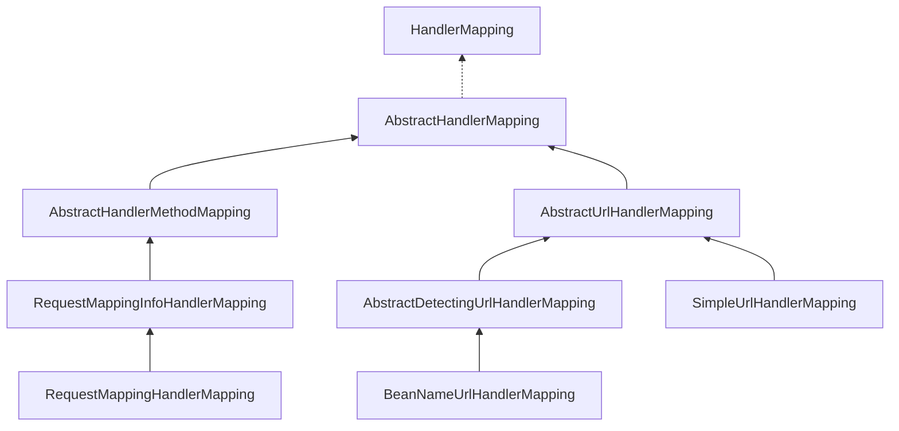

剖析Spring MVC,介绍Spring MVC中的HandlerMapping。

<!-- more -->

在前面文章中，`DispatcherServlet`接收到请求后通过`HandlerMapping`,`HandlerAdapter`来处理请求，这一章先来看`HandlerMapping`是如何工作的。



## 1. HandlerMapping
首先看`HandlerMappings`的初始化，在`DispatcherServlet`中`initStrategies`方法初始化了`HandlerMappings`。来看初始化的方法：
```java 
private void initHandlerMappings(ApplicationContext context) {
	this.handlerMappings = null;
	//默认为true
	if (this.detectAllHandlerMappings) {
		// Find all HandlerMappings in the ApplicationContext, including ancestor contexts.
		// 从容器获取所有的HandlerMappings
		Map<String, HandlerMapping> matchingBeans =
				BeanFactoryUtils.beansOfTypeIncludingAncestors(context, HandlerMapping.class, true, false);
		if (!matchingBeans.isEmpty()) {
			this.handlerMappings = new ArrayList<>(matchingBeans.values());
			// We keep HandlerMappings in sorted order.
			// 排序
			AnnotationAwareOrderComparator.sort(this.handlerMappings);
		}
	}
	//指定mapping
	else {
		try {
			HandlerMapping hm = context.getBean(HANDLER_MAPPING_BEAN_NAME, HandlerMapping.class);
			this.handlerMappings = Collections.singletonList(hm);
		}
		catch (NoSuchBeanDefinitionException ex) {
			// Ignore, we'll add a default HandlerMapping later.
		}
	}
	// Ensure we have at least one HandlerMapping, by registering
	// a default HandlerMapping if no other mappings are found.
	// 没有获取到则穿件默认到handlerMappings
	if (this.handlerMappings == null) {
		this.handlerMappings = getDefaultStrategies(context, HandlerMapping.class);
		if (logger.isDebugEnabled()) {
			logger.debug("No HandlerMappings found in servlet '" + getServletName() + "': using default");
		}
	}
}
```

## 2. AbstractHandlerMapping
再来看`HandlerMapping`是如何创建的，`AbstractHandlerMapping`实现了`HandlerMapping`,并继承了`WebApplicationObjectSupport`。在应用初始化时会调用`WebApplicationObjectSupport`抽象方法`initApplicationContext`,来看在`AbstractHandlerMapping`中的`initApplicationContext`方法：
```java
/**
	* Initializes the interceptors.
	* @see #extendInterceptors(java.util.List)
	* @see #initInterceptors()
	*/
@Override
protected void initApplicationContext() throws BeansException {
	// 并没有实现
	extendInterceptors(this.interceptors);
	// 把所有MappedInterceptor类型的bean添加到mappedInterceptors也就是adaptedInterceptors中
	detectMappedInterceptors(this.adaptedInterceptors);
	// 这里有版本变化
	// 初始化interceptors,将interceptor转换成HandlerInterceptor或者WebRequestHandlerInterceptorAdapter到adaptedInterceptors中
	//this.adaptedInterceptors.add(adaptInterceptor(interceptor))
	//
	//if (interceptor instanceof HandlerInterceptor) {
	//	return (HandlerInterceptor) interceptor;
	//}
	//else if (interceptor instanceof WebRequestInterceptor) {
	//	return new WebRequestHandlerInterceptorAdapter((WebRequestInterceptor) interceptor);
	//}
	initInterceptors();
}
```
`HandlerMapping`是通过`getHandler`方法来获取`Handler`和`Interceptor`的，来看`AbstractHandlerMapping`中具体实现：
```java
// final不可重写
@Override
@Nullable
public final HandlerExecutionChain getHandler(HttpServletRequest request) throws Exception {
	// 通过getHandlerInternal方法获取getHandlerInternal，getHandlerInternal是一个抽象模板方法
	Object handler = getHandlerInternal(request);
	if (handler == null) {
		// 获取默认的handler，获取的handler为本类的一个属性，通过set方法设置的
		handler = getDefaultHandler();
	}
	//都没有获取到handler则返回空，在DispacthServlet中会返回404
	if (handler == null) {
		return null;
	}
	// Bean name or resolved handler?
	// 如果handler类型为String则通过名字获取bean
	if (handler instanceof String) {
		String handlerName = (String) handler;
		//protected final ApplicationContext obtainApplicationContext() {
		//	ApplicationContext applicationContext = getApplicationContext();
		//	Assert.state(applicationContext != null, "No ApplicationContext");
		//  return applicationContext;
		//}
		handler = obtainApplicationContext().getBean(handlerName);
	}
	// 通过handler，request创建HandlerExecutionChain对象
	//protected HandlerExecutionChain getHandlerExecutionChain(Object handler, HttpServletRequest request) {
	//  //通过handler创建HandlerExecutionChain
	//	HandlerExecutionChain chain = (handler instanceof HandlerExecutionChain ?
	//			(HandlerExecutionChain) handler : new HandlerExecutionChain(handler));
	//
	//	String lookupPath = this.urlPathHelper.getLookupPathForRequest(request);
	//	for (HandlerInterceptor interceptor : this.adaptedInterceptors) {
	//		if (interceptor instanceof MappedInterceptor) {
	//			MappedInterceptor mappedInterceptor = (MappedInterceptor) interceptor;
	//			if (mappedInterceptor.matches(lookupPath, this.pathMatcher)) {
	//              //通过url设置MappedInterceptor
	//				chain.addInterceptor(mappedInterceptor.getInterceptor());
	//			}
	//		}
	//		else {
	//          //添加非MappedInterceptor的HandlerInterceptor
	//			chain.addInterceptor(interceptor);
	//		}
	//	}
	//	return chain;
	//}
	HandlerExecutionChain executionChain = getHandlerExecutionChain(handler, request);
	// 查看request里是否有跨域信息
	if (CorsUtils.isCorsRequest(request)) {
		// 获取配置信息
		CorsConfiguration globalConfig = this.globalCorsConfigSource.getCorsConfiguration(request);
		CorsConfiguration handlerConfig = getCorsConfiguration(handler, request);
		CorsConfiguration config = (globalConfig != null ? globalConfig.combine(handlerConfig) : handlerConfig);
		//protected HandlerExecutionChain getCorsHandlerExecutionChain(HttpServletRequest request,
		//		HandlerExecutionChain chain, @Nullable CorsConfiguration config) {
		//  //如果请求为options
		//	if (CorsUtils.isPreFlightRequest(request)) {
		//		HandlerInterceptor[] interceptors = chain.getInterceptors();
		//      //使用PreFlightHandler
		//		chain = new HandlerExecutionChain(new PreFlightHandler(config), interceptors);
		//	}
		//	else {
		//      //非ptions添加CorsInterceptor
		//		chain.addInterceptor(new CorsInterceptor(config));
		//	}
		//	return chain;
		//}
		executionChain = getCorsHandlerExecutionChain(request, executionChain, config);
	}
	return executionChain;
}
```
从上面的分析中看到获取`handler`的方法是`getHandlerInternal`,这是一个抽象模板方法，来看他的实现，在`AbstractUrlHandlerMapping`和`AbstractHandlerMethodMapping`中实现了`getHandlerInternal`。
## 3. AbstractUrlHandlerMapping
先看`AbstractUrlHandlerMapping`中的`getHandlerInternal`
```java
/**
	* Look up a handler for the URL path of the given request.
	* @param request current HTTP request
	* @return the handler instance, or {@code null} if none found
	*/
@Override
@Nullable
protected Object getHandlerInternal(HttpServletRequest request) throws Exception {
	// 通过request获取查找路径
	String lookupPath = getUrlPathHelper().getLookupPathForRequest(request);
	// 通过路径和request获取handler
	Object handler = lookupHandler(lookupPath, request);
	// 如果未获取到handler
	if (handler == null) {
		// We need to care for the default handler directly, since we need to
		// expose the PATH_WITHIN_HANDLER_MAPPING_ATTRIBUTE for it as well.
		Object rawHandler = null;
		// rootHandler
		if ("/".equals(lookupPath)) {
			rawHandler = getRootHandler();
		}
		// 默认handler
		if (rawHandler == null) {
			rawHandler = getDefaultHandler();
		}
		// 如果String类型获取bean
		if (rawHandler != null) {
			// Bean name or resolved handler?
			if (rawHandler instanceof String) {
				String handlerName = (String) rawHandler;
				rawHandler = obtainApplicationContext().getBean(handlerName);
			}
			// 抽象方法，校验
			validateHandler(rawHandler, request);
			// 设置PathExposingHandlerInterceptor，UriTemplateVariablesHandlerInterceptor
			handler = buildPathExposingHandler(rawHandler, lookupPath, lookupPath, null);
		}
	}
	if (handler != null && logger.isDebugEnabled()) {
		logger.debug("Mapping [" + lookupPath + "] to " + handler);
	}
	else if (handler == null && logger.isTraceEnabled()) {
		logger.trace("No handler mapping found for [" + lookupPath + "]");
	}
	return handler;
}
```
主要调用了三个方法：`lookupHandler`,`validateHandler`,`buildPathExposingHandler`,来看他们的代码
1. `lookupHandler`:通过`url`和`request`获取`handler`
```java
rotected Object lookupHandler(String urlPath, HttpServletRequest request) throws Exception {
	// Direct match?
	// 从handlerMap获取handler，从上文中我们没有发现handlerMap是从哪里赋值
	// 通过搜索发现handlerMap的put方法在registerHandler中调用
	// registerHandler被SimpleUrlHandlerMapping中initApplicationContext调用
	// registerHandler被AbstractDetectingUrlHandlerMapping中detectHandlers调用,detectHandlers又被initApplicationContext调用
	// detectHandlers调用模板方法determineUrlsForHandler，该方法在子类BeanNameUrlHandlerMapping中实现
	// 这些方法重写WebApplicationObjectSupport
	// 也就是说this.handlerMap在应用初始化的时候就会赋值
	Object handler = this.handlerMap.get(urlPath);
	if (handler != null) {
		// Bean name or resolved handler?
		// 如果String从容器中获取handler
		if (handler instanceof String) {
			String handlerName = (String) handler;
			handler = obtainApplicationContext().getBean(handlerName);
		}
		//校验，设置Interceptor
		validateHandler(handler, request);
		return buildPathExposingHandler(handler, urlPath, urlPath, null);
	}

	// Pattern match? Pattern匹配
	List<String> matchingPatterns = new ArrayList<>();
	for (String registeredPattern : this.handlerMap.keySet()) {
		if (getPathMatcher().match(registeredPattern, urlPath)) {
			matchingPatterns.add(registeredPattern);
		}
		else if (useTrailingSlashMatch()) {
			if (!registeredPattern.endsWith("/") && getPathMatcher().match(registeredPattern + "/", urlPath)) {
				matchingPatterns.add(registeredPattern +"/");
			}
		}
	}

	String bestMatch = null;
	Comparator<String> patternComparator = getPathMatcher().getPatternComparator(urlPath);
	if (!matchingPatterns.isEmpty()) {
		matchingPatterns.sort(patternComparator);
		if (logger.isDebugEnabled()) {
			logger.debug("Matching patterns for request [" + urlPath + "] are " + matchingPatterns);
		}
		bestMatch = matchingPatterns.get(0);
	}
	if (bestMatch != null) {
		handler = this.handlerMap.get(bestMatch);
		if (handler == null) {
			if (bestMatch.endsWith("/")) {
				handler = this.handlerMap.get(bestMatch.substring(0, bestMatch.length() - 1));
			}
			if (handler == null) {
				throw new IllegalStateException(
						"Could not find handler for best pattern match [" + bestMatch + "]");
			}
		}
		// Bean name or resolved handler?
		if (handler instanceof String) {
			String handlerName = (String) handler;
			handler = obtainApplicationContext().getBean(handlerName);
		}
		validateHandler(handler, request);
		String pathWithinMapping = getPathMatcher().extractPathWithinPattern(bestMatch, urlPath);

		// There might be multiple 'best patterns', let's make sure we have the correct URI template variables
		// for all of them
		Map<String, String> uriTemplateVariables = new LinkedHashMap<>();
		for (String matchingPattern : matchingPatterns) {
			if (patternComparator.compare(bestMatch, matchingPattern) == 0) {
				Map<String, String> vars = getPathMatcher().extractUriTemplateVariables(matchingPattern, urlPath);
				Map<String, String> decodedVars = getUrlPathHelper().decodePathVariables(request, vars);
				uriTemplateVariables.putAll(decodedVars);
			}
		}
		if (logger.isDebugEnabled()) {
			logger.debug("URI Template variables for request [" + urlPath + "] are " + uriTemplateVariables);
		}
		return buildPathExposingHandler(handler, bestMatch, pathWithinMapping, uriTemplateVariables);
	}

	// No handler found...
	// 没有找到handler返回空
	return null;
}
```
2. `validateHandler`：空的方法
3. `buildPathExposingHandler`：添加`PathExposingHandlerInterceptor`,`UriTemplateVariablesHandlerInterceptor`拦截器，主要作用是`request`添加一些属性，例如`request.setAttribute(URI_TEMPLATE_VARIABLES_ATTRIBUTE, uriTemplateVariables)`。

子类`SimpleUrlHandlerMapping`,`AbstractDetectingUrlHandlerMapping`,`BeanNameUrlHandlerMapping`在上面代码注释中介绍。
## 4. AbstractHandlerMethodMapping
首先看到`AbstractHandlerMethodMapping`实现了`InitializingBean`并重写了`afterPropertiesSet`（初始化bean的时候会执行该方法）,可以看到调用`initHandlerMethods`,来看这个方法：
```java
protected void initHandlerMethods() {
	if (logger.isDebugEnabled()) {
		logger.debug("Looking for request mappings in application context: " + getApplicationContext());
	}
	String[] beanNames = (this.detectHandlerMethodsInAncestorContexts ?
			BeanFactoryUtils.beanNamesForTypeIncludingAncestors(obtainApplicationContext(), Object.class) :
			obtainApplicationContext().getBeanNamesForType(Object.class));

	for (String beanName : beanNames) {
		if (!beanName.startsWith(SCOPED_TARGET_NAME_PREFIX)) {
			Class<?> beanType = null;
			try {
				beanType = obtainApplicationContext().getType(beanName);
			}
			catch (Throwable ex) {
				// An unresolvable bean type, probably from a lazy bean - let's ignore it.
				if (logger.isDebugEnabled()) {
					logger.debug("Could not resolve target class for bean with name '" + beanName + "'", ex);
				}
			}
			// 检查是否含有Controller或者RequestMapping注释
			// (AnnotatedElementUtils.hasAnnotation(beanType, Controller.class) ||
			// AnnotatedElementUtils.hasAnnotation(beanType, RequestMapping.class))
			if (beanType != null && isHandler(beanType)) {
				detectHandlerMethods(beanName);
			}
		}
	}
	//handlerMethodsInitialized是空的
	handlerMethodsInitialized(getHandlerMethods());
}
```
可以看到关键调用了`detectHandlerMethods`方法，来看`detectHandlerMethods`:
```java
// Look for handler methods in a handler.
protected void detectHandlerMethods(final Object handler) {
	//获取handler类型
	Class<?> handlerType = (handler instanceof String ?
			obtainApplicationContext().getType((String) handler) : handler.getClass());
	if (handlerType != null) {
		//获取真实类型
		//if (clazz.getName().contains(CGLIB_CLASS_SEPARATOR)) {
		//	Class<?> superclass = clazz.getSuperclass();
		//	if (superclass != null && Object.class != superclass) {
		//		return superclass;
		//    	}
		//    }
		//return clazz;
		final Class<?> userType = ClassUtils.getUserClass(handlerType);
		Map<Method, T> methods = MethodIntrospector.selectMethods(userType,
				(MethodIntrospector.MetadataLookup<T>) method -> {
					try {
						return getMappingForMethod(method, userType);
					}
					catch (Throwable ex) {
						throw new IllegalStateException("Invalid mapping on handler class [" +
								userType.getName() + "]: " + method, ex);
					}
				});
		if (logger.isDebugEnabled()) {
			logger.debug(methods.size() + " request handler methods found on " + userType + ": " + methods);
		}
		//遍历注册HandlerMethod
		methods.forEach((method, mapping) -> {
			Method invocableMethod = AopUtils.selectInvocableMethod(method, userType);
			registerHandlerMethod(handler, invocableMethod, mapping);
		});
	}
}
```
来看上面的方法`selectMethods`,`getMappingForMethod`,`registerHandlerMethod`，具体看这三个方法
1. `selectMethods`
```java
public static <T> Map<Method, T> selectMethods(Class<?> targetType, final MetadataLookup<T> metadataLookup) {
	final Map<Method, T> methodMap = new LinkedHashMap<>();
	Set<Class<?>> handlerTypes = new LinkedHashSet<>();
	Class<?> specificHandlerType = null;
    //把自身添加到handlerTypes
	if (!Proxy.isProxyClass(targetType)) {
		specificHandlerType = ClassUtils.getUserClass(targetType);
		handlerTypes.add(specificHandlerType);
	}
	handlerTypes.addAll(ClassUtils.getAllInterfacesForClassAsSet(targetType));

	for (Class<?> currentHandlerType : handlerTypes) {
		final Class<?> targetClass = (specificHandlerType != null ? specificHandlerType : currentHandlerType);

		ReflectionUtils.doWithMethods(currentHandlerType, method -> {
			Method specificMethod = ClassUtils.getMostSpecificMethod(method, targetClass);
			//回调inspect（）方法给个函数生成RequestMappingInfo
			T result = metadataLookup.inspect(specificMethod);
			if (result != null) {
				Method bridgedMethod = BridgeMethodResolver.findBridgedMethod(specificMethod);
				if (bridgedMethod == specificMethod || metadataLookup.inspect(bridgedMethod) == null) {
					//将生成的RequestMappingInfo保存到methodMap中
					methodMap.put(specificMethod, result);
				}
			}
		}, ReflectionUtils.USER_DECLARED_METHODS);
	}
	//返回保存函数映射信息后的methodMap
	return methodMap;
}
```
可以看到回调了`getMappingForMethod`,来看`getMappingForMethod`是如何生成`RequestMappingInfo`。
`getMappingForMethod`是一个模板方法在子类`RequestMappingHandlerMapping`实现。
2. `getMappingForMethod`
```java
protected RequestMappingInfo getMappingForMethod(Method method, Class<?> handlerType) {
	//构建RequestMappingInfo
	RequestMappingInfo info = createRequestMappingInfo(method);
	if (info != null) {
		RequestMappingInfo typeInfo = createRequestMappingInfo(handlerType);
		if (typeInfo != null) {
			info = typeInfo.combine(info);
		}
	}
	return info;
}

private RequestMappingInfo createRequestMappingInfo(AnnotatedElement element) {
	RequestMapping requestMapping = AnnotatedElementUtils.findMergedAnnotation(element, RequestMapping.class);
	RequestCondition<?> condition = (element instanceof Class ?
			getCustomTypeCondition((Class<?>) element) : getCustomMethodCondition((Method) element));
	return (requestMapping != null ? createRequestMappingInfo(requestMapping, condition) : null);
}

protected RequestMappingInfo createRequestMappingInfo(
		RequestMapping requestMapping, @Nullable RequestCondition<?> customCondition) {
	//构建了RequestMappingInfo返回
	RequestMappingInfo.Builder builder = RequestMappingInfo
			.paths(resolveEmbeddedValuesInPatterns(requestMapping.path()))
			.methods(requestMapping.method())
			.params(requestMapping.params())
			.headers(requestMapping.headers())
			.consumes(requestMapping.consumes())
			.produces(requestMapping.produces())
			.mappingName(requestMapping.name());
	if (customCondition != null) {
		builder.customCondition(customCondition);
	}
	return builder.options(this.config).build();
}
```
3. `registerHandlerMethod`:把HandlerMethod放到map中

再来看如何获取

```java
protected HandlerMethod getHandlerInternal(HttpServletRequest request) throws Exception {
	//获取url
	String lookupPath = getUrlPathHelper().getLookupPathForRequest(request);
	if (logger.isDebugEnabled()) {
		logger.debug("Looking up handler method for path " + lookupPath);
	}
	//锁
	this.mappingRegistry.acquireReadLock();
	try {
		//获取构建HandlerMethod
		HandlerMethod handlerMethod = lookupHandlerMethod(lookupPath, request);
		if (logger.isDebugEnabled()) {
			if (handlerMethod != null) {
				logger.debug("Returning handler method [" + handlerMethod + "]");
			}
			else {
				logger.debug("Did not find handler method for [" + lookupPath + "]");
			}
		}
		//调用createWithResolvedBean返回
		return (handlerMethod != null ? handlerMethod.createWithResolvedBean() : null);
	}
	finally {
		this.mappingRegistry.releaseReadLock();
	}
}
```

来看`lookupHandlerMethod`
```java
protected HandlerMethod lookupHandlerMethod(String lookupPath, HttpServletRequest request) throws Exception {
	List<Match> matches = new ArrayList<>();
	List<T> directPathMatches = this.mappingRegistry.getMappingsByUrl(lookupPath);
	if (directPathMatches != null) {
		addMatchingMappings(directPathMatches, matches, request);
	}
	if (matches.isEmpty()) {
		// No choice but to go through all mappings...
		addMatchingMappings(this.mappingRegistry.getMappings().keySet(), matches, request);
	}

	if (!matches.isEmpty()) {
		Comparator<Match> comparator = new MatchComparator(getMappingComparator(request));
		matches.sort(comparator);
		if (logger.isTraceEnabled()) {
			logger.trace("Found " + matches.size() + " matching mapping(s) for [" + lookupPath + "] : " + matches);
		}
		Match bestMatch = matches.get(0);
		if (matches.size() > 1) {
			if (CorsUtils.isPreFlightRequest(request)) {
				return PREFLIGHT_AMBIGUOUS_MATCH;
			}
			Match secondBestMatch = matches.get(1);
			if (comparator.compare(bestMatch, secondBestMatch) == 0) {
				Method m1 = bestMatch.handlerMethod.getMethod();
				Method m2 = secondBestMatch.handlerMethod.getMethod();
				throw new IllegalStateException("Ambiguous handler methods mapped for HTTP path '" +
						request.getRequestURL() + "': {" + m1 + ", " + m2 + "}");
			}
		}
		handleMatch(bestMatch.mapping, lookupPath, request);
		return bestMatch.handlerMethod;
	}
	else {
		return handleNoMatch(this.mappingRegistry.getMappings().keySet(), lookupPath, request);
	}
}
```
总结：
在`DispatcherServlet`的`doDispatch`获取到了`HandlerExecutionChain`。

`HandlerExecutionChain`包含`Handler`,`HandlerInterceptor`:
1. `HandlerInterceptor`：在`AbstractHandlerMapping`中获取。
2. `Handler`：由`AbstractHandlerMapping`的子类实现`getHandlerInternal`获取。

`AbstractHandlerMapping`有俩条分支：
1. `AbstractUrlHandlerMapping`：简单的说Handler就是Controller类，片面理解为一个Controller只能对应一个请求，可以实现`AbstractController`及子类。在实际中也就是BeanNameUrlHandlerMapping，SimpleUrlHandlerMapping的使用。
2. `AbstractHandlerMethodMapping`：使用最多的HandlerMethod，也就是映射到方法。HandlerMethod类型的Handler。RequestMappingHandlerMapping的使用。


