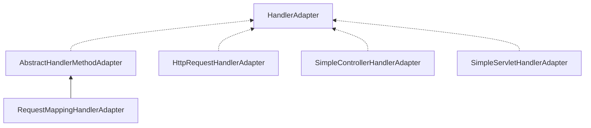

剖析Spring MVC,介绍Spring MVC中的HandlerAdapter。

<!-- more -->

在前面文章中，`DispatcherServlet`接收到请求后通过`HandlerMapping`,`HandlerAdapter`来处理请求，这一章先来看`HandlerAdapter`是如何工作的。


```java
public interface HandlerAdapter {

	boolean supports(Object handler);

	@Nullable
	ModelAndView handle(HttpServletRequest request, HttpServletResponse response, Object handler) throws Exception;

	long getLastModified(HttpServletRequest request, Object handler);

}
```
`HandlerAdapter`包含三个方法分别为：是否支持handler，使用handler处理请求，获取资源的LastModified值。

在处理一个请求时。`DispatcherServlet`中的`doDispatch`会获取`handler`,然后通过`handler`获取`HandlerAdapter`,获取到`HandlerAdapter`后调用`handle`方法，获取`ModelAndView`，返回请求。
```java
//获取HandlerAdapter
HandlerAdapter ha = getHandlerAdapter(mappedHandler.getHandler());

protected HandlerAdapter getHandlerAdapter(Object handler) throws ServletException {
  if (this.handlerAdapters != null) {
    for (HandlerAdapter ha : this.handlerAdapters) {
      if (logger.isTraceEnabled()) {
        logger.trace("Testing handler adapter [" + ha + "]");
      }
      //使用supports方法寻找合适的适配器子类
      if (ha.supports(handler)) {
        return ha;
      }
    }
  }
  throw new ServletException("No adapter for handler [" + handler +
      "]: The DispatcherServlet configuration needs to include a HandlerAdapter that supports this handler");
}
//获取lastModified
long lastModified = ha.getLastModified(request, mappedHandler.getHandler());
//获取ModelAndView
mv = ha.handle(processedRequest, response, mappedHandler.getHandler());
```
以上基本解释了HandlerAdapter的这三个方法。再来看他的实现。

## 1. HttpRequestHandlerAdapter
 适配HTTP请求处理器适配器，适配HttpRequest类型handler。
1. supports：`handler instanceof HttpRequestHandler`，适配HttpRequestHandler。
2. handle：调用`HttpRequestHandler`的handleRequest方法。

## 2. SimpleControllerHandlerAdapter
适配Controller类型的handler(实现Controller)。
1. supports：`handler instanceof Controller`，适配Controller。
2. handle：调用`Controller`的handleRequest方法。 

## 3. SimpleServletHandlerAdapter
适配servlet类型的handler。
1. supports：`handler instanceof Servlet`，适配Servlet。
2. handle：调用`Servlet`的service方法。 

## 4. RequestMappingHandlerAdapter
`AbstractHandlerMethodAdapter`,`RequestMappingHandlerAdapter`：注解方式，适配HandlerMethod。

`RequestMappingHandlerAdapter`继承`AbstractHandlerMethodAdapter`，AbstractHandlerMethodAdapter为一个抽象模板模板。

1. supports：`handler instanceof HandlerMethod && supportsInternal((HandlerMethod) handler)`,适配HandlerMethod，supportsInternal为抽象模板方法，在子类中直接返回了true。
2. handle：调用本类中`handleInternal`抽象方法。在子类中`RequestMappingHandlerAdapter`实现。

下面详细看RequestMappingHandlerAdapter，

1. RequestMappingHandlerAdapter的创建：
`RequestMappingHandlerAdapter`实现`InitializingBean`,

2. RequestMappingHandlerAdapter的使用：


```java
@Override
protected ModelAndView handleInternal(HttpServletRequest request,
    HttpServletResponse response, HandlerMethod handlerMethod) throws Exception {

  ModelAndView mav;
  checkRequest(request);

  // Execute invokeHandlerMethod in synchronized block if required.
  if (this.synchronizeOnSession) {
    HttpSession session = request.getSession(false);
    if (session != null) {
      Object mutex = WebUtils.getSessionMutex(session);
      synchronized (mutex) {
        mav = invokeHandlerMethod(request, response, handlerMethod);
      }
    }
    else {
      // No HttpSession available -> no mutex necessary
      mav = invokeHandlerMethod(request, response, handlerMethod);
    }
  }
  else {
    // No synchronization on session demanded at all...
    mav = invokeHandlerMethod(request, response, handlerMethod);
  }

  if (!response.containsHeader(HEADER_CACHE_CONTROL)) {
    if (getSessionAttributesHandler(handlerMethod).hasSessionAttributes()) {
      applyCacheSeconds(response, this.cacheSecondsForSessionAttributeHandlers);
    }
    else {
      prepareResponse(response);
    }
  }

  return mav;
}
```