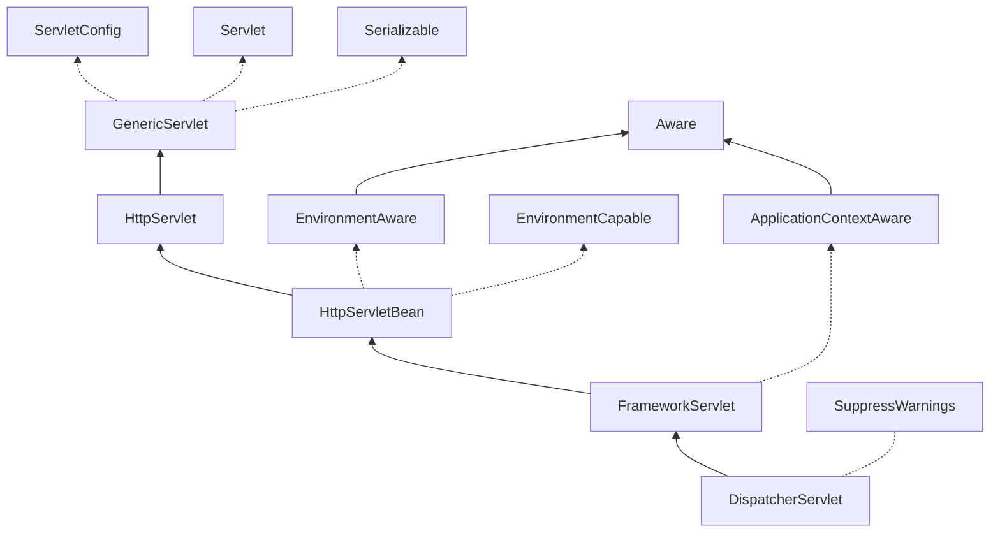

剖析Spring MVC,介绍Spring MVC的结构与创建过程。

<!-- more -->

首先看`Spring MVC`的结构。我们知道Spring MVC从创建`DispatcherServlet`开始:


可以看到`DispatcherServlet`继承`FrameworkServlet`,`FrameworkServlet`继承`HttpServletBean`,`HttpServletBean`继承`Servlet`中的`HttpServlet`。

## 1. 接口
这三个类实现了`EnvironmentCapable`,`EnvironmentAware`.`ApplicationContextAware`接口。可以实现这些接口获取`Environment`,`ApplicationContext`。

`Environment`：应用运行的环境，包括应用环境的：`Profiles`和`Properties`

```java
public interface Environment extends PropertyResolver {
  
  //获取激活的Profiles
  String[] getActiveProfiles();
  //没有找到激活的则找默认的Profiles
  String[] getDefaultProfiles();

  @Deprecated
  boolean acceptsProfiles(String... profiles);
  boolean acceptsProfiles(Profiles profiles);
}
```
```java
public interface PropertyResolver {
  boolean containsProperty(String key);
  @Nullable
  String getProperty(String key);
  String getProperty(String key, String defaultValue);
  @Nullable
  <T> T getProperty(String key, Class<T> targetType);
  <T> T getProperty(String key, Class<T> targetType, T defaultValue);
  String getRequiredProperty(String key) throws IllegalStateException;
  <T> T getRequiredProperty(String key, Class<T> targetType) throws IllegalStateException;
  String resolvePlaceholders(String text);
  String resolveRequiredPlaceholders(String text) throws IllegalArgumentException;
}

```
### 1. Profiles
`profile`配置是一个被命名的、bean定义的逻辑组,当`profile`激活时对应的`bean`会被注册到容器中，这样就能实现不同环境不同配置的切换，如开发中dev,sit,pro环境。可以使用`xml`,`@Profile`,环境变量，JVM参数，`Maven`等设置。

```java
//注解
@Component
@Profile("dev")
public class DevDatasourceConfig
//xml
<beans profile="dev">
    <bean id="devDatasourceConfig"
      class="DevDatasourceConfig" />
</beans>
//WebApplicationInitializer
servletContext.setInitParameter("spring.profiles.active", "dev");
//JVM参数
java -jar xxx.jar -Dspring.profiles.active=dev
//环境变量
export spring_profiles_active=dev
//maven
<profiles>
    <profile>
        <id>dev</id>
        <activation>
            <activeByDefault>true</activeByDefault>
        </activation>
        <properties>
            <spring.profiles.active>dev</spring.profiles.active>
        </properties>
    </profile>
    <profile>
        <id>pro</id>
        <properties>
            <spring.profiles.active>pro</spring.profiles.active>
        </properties>
    </profile>
</profiles>

mvn install -Pdev
```

### 2. Properties
`properties`配置属性，常见的`.properties`文件，`JVM properties`,`system环境`

## 2. HttpServletBean
```java
@Override
public final void init() throws ServletException {
  //设置参数
  PropertyValues pvs = new ServletConfigPropertyValues(getServletConfig(), this.requiredProperties);
  if (!pvs.isEmpty()) {
    try {
      BeanWrapper bw = PropertyAccessorFactory.forBeanPropertyAccess(this);
      ResourceLoader resourceLoader = new ServletContextResourceLoader(getServletContext());
      bw.registerCustomEditor(Resource.class, new ResourceEditor(resourceLoader, getEnvironment()));
      //抽象方法。
      initBeanWrapper(bw);
      bw.setPropertyValues(pvs, true);
      }
    catch (BeansException ex) {
      if (logger.isErrorEnabled()) {
        logger.error("Failed to set bean properties on servlet '" + getServletName() + "'", ex);
      }
      throw ex;
    }
  }
  // 抽象方法。初始化工作，调用子类（FrameworkServlet）initServletBean()方法
  initServletBean();
}
```
## 3. FrameworkServlet

从`HttpServletBean`可以看到调用`initServletBean()`方法。
```java
/**
 * Overridden method of {@link HttpServletBean}, invoked after any bean properties
 * have been set. Creates this servlet's WebApplicationContext.
 */
@Override
protected final void initServletBean() throws ServletException {
  getServletContext().log("Initializing Spring " + getClass().getSimpleName() + " '" + getServletName() + "'");
  if (logger.isInfoEnabled()) {
    logger.info("Initializing Servlet '" + getServletName() + "'");
  }
  long startTime = System.currentTimeMillis();
  try {
    //初始化webApplicationContext
    this.webApplicationContext = initWebApplicationContext();
    //抽象方法，子类并没有实现
    initFrameworkServlet();
  }
  catch (ServletException | RuntimeException ex) {
    logger.error("Context initialization failed", ex);
    throw ex;
  }
  if (logger.isDebugEnabled()) {
  String value = this.enableLoggingRequestDetails ?
      "shown which may lead to unsafe logging of potentially sensitive data" :
      "masked to prevent unsafe logging of potentially sensitive data";
  logger.debug("enableLoggingRequestDetails='" + this.enableLoggingRequestDetails +
      "': request parameters and headers will be " + value);
  }
  if (logger.isInfoEnabled()) {
    logger.info("Completed initialization in " + (System.currentTimeMillis() - startTime) + " ms");
  }
}
```
来看`initWebApplicationContext()`
```java
protected WebApplicationContext initWebApplicationContext() {
  //获取rootContext
  //String ROOT_WEB_APPLICATION_CONTEXT_ATTRIBUTE = WebApplicationContext.class.getName() + ".ROOT";
  //Object attr = sc.getAttribute(WebApplicationContext.ROOT_WEB_APPLICATION_CONTEXT_ATTRIBUTE);
  //从ServletContext中获取名为WebApplicationContext.ROOT_WEB_APPLICATION_CONTEXT_ATTRIBUTE的Object
  WebApplicationContext rootContext =
          WebApplicationContextUtils.getWebApplicationContext(getServletContext());
  WebApplicationContext wac = null;
  //如果已经设置了webApplicationContext
  if (this.webApplicationContext != null) {
      // A context instance was injected at construction time -> use it
      wac = this.webApplicationContext;
      if (wac instanceof ConfigurableWebApplicationContext) {
          ConfigurableWebApplicationContext cwac = (ConfigurableWebApplicationContext) wac;
          if (!cwac.isActive()) {
              // The context has not yet been refreshed -> provide services such as
              // setting the parent context, setting the application context id, etc
              if (cwac.getParent() == null) {
                  // The context instance was injected without an explicit parent -> set
                  // the root application context (if any; may be null) as the parent
                  cwac.setParent(rootContext);
              }
              configureAndRefreshWebApplicationContext(cwac);
          }
      }
  }
  if (wac == null) {
      //如果WebApplicationContext未设置，从ServletContext中获取
      //WebApplicationContext wac = WebApplicationContextUtils.getWebApplicationContext(getServletContext(), attrName);
      wac = findWebApplicationContext();
  }
  if (wac == null) {
      //如果还未获取到，创建一个
      //设置一些东西，特别是设置了一个ContextRefreshListener监听
      //public void onApplicationEvent(ContextRefreshedEvent event) {
      //  this.refreshEventReceived = true; //表示已经onRefresh
      //  synchronized (this.onRefreshMonitor) {
      //  onRefresh(event.getApplicationContext());//onRefresh
      //  }
      //}
      //onApplicationEvent()->
      wac = createWebApplicationContext(rootContext);
  }
  //如果没有onRefresh过则onRefreshÒÒÒÒÒÒ
  if (!this.refreshEventReceived) {
      synchronized (this.onRefreshMonitor) {
          //抽象方法。子类重写
          onRefresh(wac);
      }
  }
  //把WebApplicationContext设置到ServletContext中
  if (this.publishContext) {
      // Publish the context as a servlet context attribute.
      String attrName = getServletContextAttributeName();
      getServletContext().setAttribute(attrName, wac);
  
  return wac;
  }
```
## 4. DispatcherServlet

从`FrameworkServlet`看出，调用`DispatcherServlet`中`onRefresh`方法。`onRefresh()->initStrategies()`

```java
/**
 * This implementation calls {@link #initStrategies}.
 */
@Override
protected void onRefresh(ApplicationContext context) {
    initStrategies(context);
}

/**
 * 初始化组件
 * Initialize the strategy objects that this servlet uses.
 * <p>May be overridden in subclasses in order to initialize further strategy objects.
 */
protected void initStrategies(ApplicationContext context) {
    initMultipartResolver(context);
    initLocaleResolver(context);
    initThemeResolver(context);
    initHandlerMappings(context);
    initHandlerAdapters(context);
    initHandlerExceptionResolvers(context);
    initRequestToViewNameTranslator(context);
    initViewResolvers(context);
    initFlashMapManager(context);
}
```
初始化组件会从`context`中获取，如果获取不到会调用`getDefaultStrategies()`。通过默认文件`DispatcherServlet.properties`初始化组件
```java
private static final Properties defaultStrategies;

private static final String DEFAULT_STRATEGIES_PATH = "DispatcherServlet.properties";

static {
	// Load default strategy implementations from properties file.
	// This is currently strictly internal and not meant to be customized
	// by application developers.
	try {
		ClassPathResource resource = new ClassPathResource(DEFAULT_STRATEGIES_PATH, DispatcherServlet.class);
		defaultStrategies = PropertiesLoaderUtils.loadProperties(resource);
	}
	catch (IOException ex) {
		throw new IllegalStateException("Could not load '" + DEFAULT_STRATEGIES_PATH + "': " + ex.getMessage());
	}
}
/**
 * Create a List of default strategy objects for the given strategy interface.
 * <p>The default implementation uses the "DispatcherServlet.properties" file (in the same
 * package as the DispatcherServlet class) to determine the class names. It instantiates
 * the strategy objects through the context's BeanFactory.
 * @param context the current WebApplicationContext
 * @param strategyInterface the strategy interface
 * @return the List of corresponding strategy objects
 */
@SuppressWarnings("unchecked")
protected <T> List<T> getDefaultStrategies(ApplicationContext context, Class<T> strategyInterface) {
  String key = strategyInterface.getName();
  String value = defaultStrategies.getProperty(key);
  if (value != null) {
      String[] classNames = StringUtils.commaDelimitedListToStringArray(value);
      List<T> strategies = new ArrayList<>(classNames.length);
      for (String className : classNames) {
          try {
              Class<?> clazz = ClassUtils.forName(className, DispatcherServlet.class.getClassLoader());
              Object strategy = createDefaultStrategy(context, clazz);
              strategies.add((T) strategy);
          }
          catch (ClassNotFoundException ex) {
              throw new BeanInitializationException(
                      "Could not find DispatcherServlet's default strategy class [" + className +
                              "] for interface [" + key + "]", ex);
          }
          catch (LinkageError err) {
              throw new BeanInitializationException(
                      "Unresolvable class definition for DispatcherServlet's default strategy class [" +
                              className + "] for interface [" + key + "]", err);
          }
      }
      return strategies;
  }
  else {
      return new LinkedList<>();
  }
}
```
